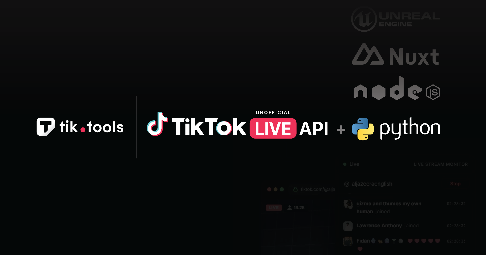

 

---

### About

Developer and maintainer of the **TikTool** ecosystem — a managed API platform for TikTok LIVE stream data. Provides real-time WebSocket delivery of chat, gifts, viewer metrics, battles, and engagement events.

### Projects

| Repository | Description | Stack |
|:-----------|:------------|:------|
| [`@tiktool/live`](https://github.com/tiktool/tiktok-live-api) | Node.js / TypeScript SDK for TikTok LIVE | TypeScript |
| [`tiktok-live-python`](https://github.com/tiktool/tiktok-live-python) | Python SDK for TikTok LIVE | Python |
| [`tiktok-live-captions`](https://github.com/tiktool/tiktok-live-captions) | Real-time AI captions and transcription | TypeScript |
| [`docs`](https://github.com/tiktool/docs) | API documentation and reference | Mintlify |
| [`tik.tools`](https://tik.tools) | Managed API platform — WebSocket, REST, SDK | Nuxt 3 |

### Stack

`Node.js` · `TypeScript` · `Python` · `Nuxt 3` · `WebSocket` · `Unreal Engine 5` · `PostgreSQL` · `Redis`
